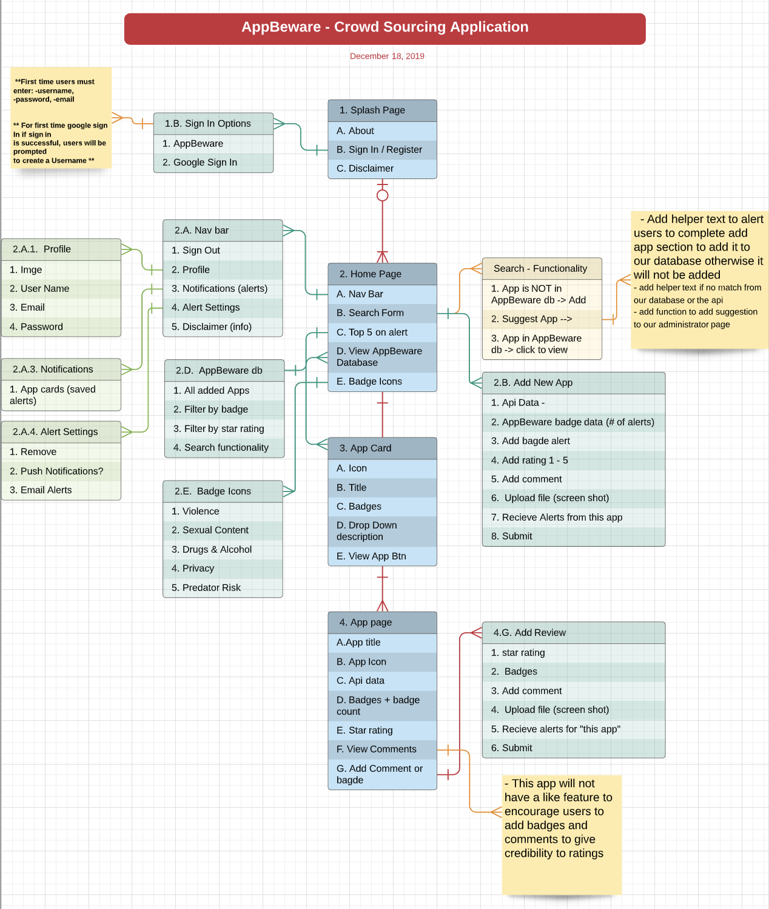
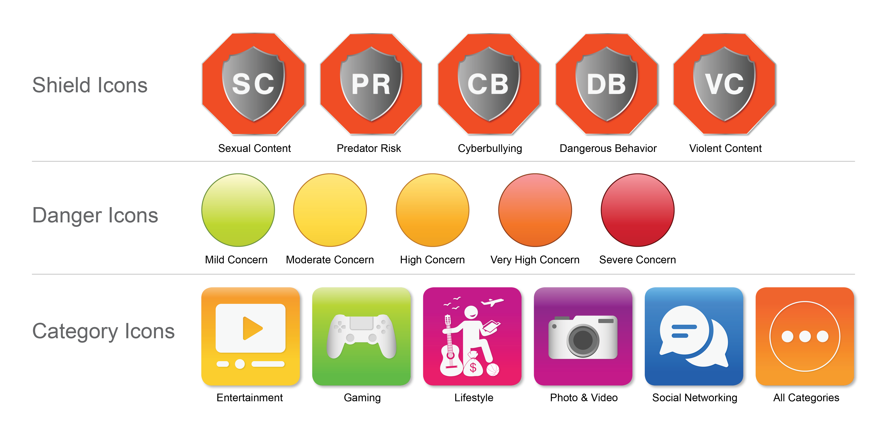
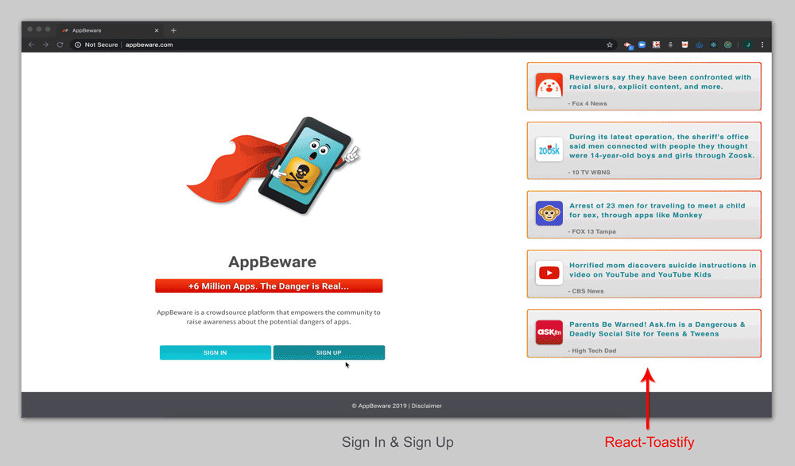

 
# Welcome to AppBeware!

#### AppBeware is a crowdsource platform that empowers the community to raise awareness about the potential dangers of apps.
---

#### Collaborators: 
* [Ethan Donahue](https://github.com/EthanD0922) | Backend Developer  
* [Scott Moore](https://github.com/woodwindscott) | Backend Developer 
* [Jessie Sholler](https://github.com/JAE-S) | Visual Designer & Front-End Developer 
* [LaMana Donadelle](https://github.com/lamanaml) | Front-End Developer  

---

## Table of Contents
  * [Problem & Solotuion](#the-problem)
  * [User Story](#user-story)
  * [Design Process](#design-process)
  * [API'S](#API'S)
  * [Technologies](#technologies)
  * [Features And Functionality](#features-and-functionality)
  * [Brainstorming Document](#brainstorming-document)
  * [Resource Links](#resource-links)
  * [File Architecture](#file-architecture)
  * [Click here to visit the site!](http://www.appbeware.com)

---

### The Problem:  
 <b>With over 6 million + Apps There are very few timely, relevant, current and credible sources to determine if apps could be potentially dangerous.<b> 
   
 Current Resources: 
   1. Google Search: Returns thousands of results. It's difficult to determine relevant or credible content.
   2. Curated Sites: Editorial content may be based on limited opinions and not real experiences.  May be rated on criteria that is not relevant to all parents.
   3. News: This information is usually available after an event occurs. By this time, your child may have already been exposed.
   4. Word of Mouth: This information is usually slow traveling, and may never reach the people who may find it useful.

### The Solution:  
  * Create a platform for users to share their personal experiences with dangerous apps 
  * Provide a standardized alert system  
  * Primary alerts established based on the community​'s concerns
  * Display trending apps
  * Credibility through authentication

---

## User Story
  1. As a user, I want to flag apps that I have found to be dangerous so that I can help other users make informed decisions about the dangers of apps for their children. // make aware​

  2. As a user, I want an up-to-date, credible, reliable source to help traverse the app world so that I can determine if an app is dangerous for my child. // become aware​

  3. As a user, I want to be able to get updates about apps that I am concerned about. // stay aware

---

## Design Process

* <b>Planning:</b> Informed by the user stories, an Entity Relationship Digram was created to map out essential features of the site. The ERD  was then used as a blueprint for the low-fidelity wireframes.

* <b>Demo:</b>

* <b>Graphic Icons:</b> When creating the icons we tried to use familiar shapes that users could easily identify with. The shield icon's primary shape resembles a stop sign with the inner shape constructed as a shield. These iconic shapes work together to visually represent our user story (make aware, become aware, stay aware).
    

     
---

## API'S

* <b>App meta data API: </b> https://42matters.com/app-market-data

---
## Technologies
> <b>Design Tools:</b>
  * Adobe Illustrator
  * Adobe Photoshop
  * Adobe XD
  
> <b>Development Tools:</b>
  * <b>Framework:</b> Material UI
  * React
  * Redux
  * Redux-thunk
  * Connected-react-router
  * History
  * Clsx
  * Downshift
  * Toastify
  * Proptypes
  * MySQL
  * Express
  * Sequelize
  * Path 
  * Node 
  * if-env
  * Moment
  * Passport
  * Nodemon
  * Concurrently
  * Heroku (Heroku build)
  * GoDaddy url registration 
---

## Features And Functionality

---

## Brainstorming Document
* [Google Doc](https://docs.google.com/document/d/1upcb7oJcZ5eXzW1HB9fcMNAPfmZxc_v0ng-4Bvco6Q0/edit?usp=sharing)
* [ERD](https://www.lucidchart.com/invitations/accept/9112df75-21a5-4836-907d-e3a6be71452f)

---

## Resource Links

  * <b>ERD:</b> https://www.lucidchart.com/   
  * <b>Ratings Guide:</b> https://www.esrb.org/ratings-guide/
  * <b>API access to Mobile Data:</b> https://42matters.com/app-market-data
  * <b>React Native:</b> https://github.com/facebook/react-native/tree/master/RNTester

---

## File Architecture

<b>Click To View</b>

 

         AppBeware
         ├── Client
         │   ├── build
         │   ├── node_modules
         │   ├── public
         │   ├── src
         │   │   ├── assets
         |   │   │   ├── images
         |   │   │   ├── Readme_assets
         |   │   │   └── styling
         │   │   ├── components
         |   │   │   ├── AboutTheShields
         |   │   │   ├── AddAppReview
         |   │   │   ├── Alerts
         |   │   │   ├── AppPageComponents
         |   │   │   ├── CategoryCards
         |   │   │   ├── Footer
         |   │   │   ├── HeaderContainer
         |   │   │   ├── HomePageShieldLayout
         |   │   │   ├── HomepageTabNav
         |   │   │   ├── HoverShieldInfo
         |   │   │   ├── Modals
         |   │   │   ├── Nav
         |   │   │   ├── Ratings
         |   │   │   ├── SearchAppAnnie
         |   │   │   ├── SearchResults
         |   │   │   ├── SignIn
         |   │   │   ├── SignUp
         |   │   │   ├── Toasties
         |   │   │   ├── TopTrendingApps
         |   │   │   ├── UserDetailsPanel
         |   │   │   └── Wrapper
         │   │   ├── pages
         |   │   │   ├── AppPage.js
         |   │   │   ├── CategoryPage.js
         |   │   │   ├── Disclaimer.js
         |   │   │   ├── Homepage.js
         |   │   │   ├── ProfilePage.js
         |   │   │   └── SplashPage.js
         │   │   ├── Store
         |   │   │   ├── Actions
         |   │   │   ├── Reducers
         |   │   │   ├── history.js
         |   │   │   ├── index.js
         |   │   │   └── InitialState.json
         │   │   ├── utils
         │   │   ├── App.js
         │   │   └── index.js
         │   ├── .gitignore
         │   ├── package.json
         │   └── Readme.md
         ├── config
         ├── controllers
         ├── db
         ├── middlewares
         ├── models
         ├── node_modules
         ├── routes
         ├── .gitignore
         ├── package.json
         ├── Readme.md 
         └── server.js

---

[Back To Top](#welcome-to-AppBeware)

